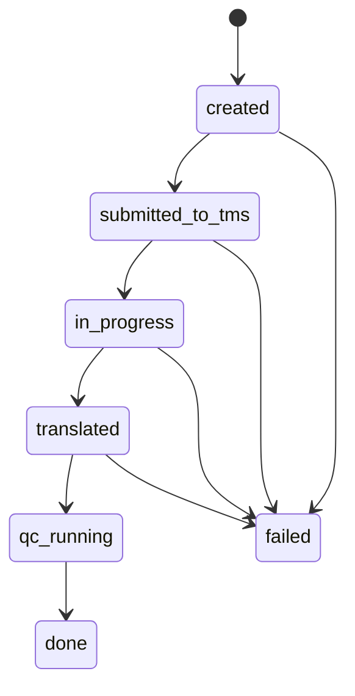
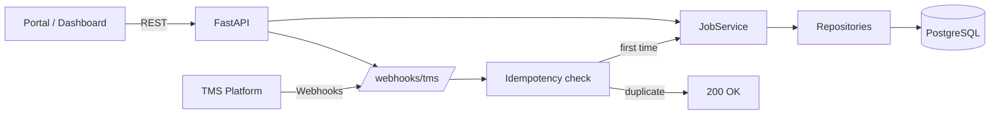

# LocPortal Backend – Architecture, Workflow & Interview Notes

This document serves both as **developer documentation** and **interview preparation material** for the LocPortal backend project.

It explains:
- architectural decisions
- implemented workflows
- reliability mechanisms (idempotency)
- how each part maps to typical interview questions

---

## 1. High-level overview

LocPortal is a **job-based localisation backend** built with:
- FastAPI (REST API)
- PostgreSQL (Docker, WSL)
- SQLAlchemy (ORM)
- Pydantic (API & LLM validation)
- External integrations:
  - TMS (Phrase / Memsource-like)
  - LLM-based QC (planned)
- Event-driven processing via webhooks

The system is designed to be:
- modular
- production-oriented
- resilient to retries and failures

---

## 2. Backend responsibilities

- Accept localisation jobs from a portal/dashboard
- Persist job state and content
- Create jobs in a TMS project
- Receive and process TMS webhooks
- Run Quality Checks (QC) via LLMs (future)
- Expose job status and results via REST

---

## 3. Configuration & environment management

### Implementation
- Centralised configuration using **Pydantic Settings**
- Environment-driven (`.env.local`, `.env.prod`)
- Cached via `lru_cache` to avoid repeated parsing

Key settings:
- `DATABASE_URL`
- `TMS_PROVIDER`
- `TMS_PROJECT_ID`
- `TMS_API_TOKEN`
- `LLM_PROVIDER`
- HTTP timeouts / retries

### Interview Q/A
**Q:** Why do you use `lru_cache` for settings?  
**A:** FastAPI dependencies may be resolved multiple times. Caching ensures settings are instantiated once, avoids repeated env parsing, and guarantees consistent configuration across the app.

---

## 4. Database & persistence

### Technology
- PostgreSQL (Docker in WSL)
- SQLAlchemy 2.x
- Postgres-native types:
  - UUID primary keys
  - JSONB for structured content and QC reports

### Job model (simplified)
- `id` (UUID)
- `status`
- `source_locale`
- `target_locales` (JSONB)
- `source_content` (JSONB)
- `translated_content` (JSONB)
- `qc_report` (JSONB)
- `tms_provider`, `tms_job_id`
- timestamps

### Interview Q/A
**Q:** Why JSONB instead of text columns?  
**A:** Localisation payloads and QC results are structured JSON. JSONB avoids manual serialization, is queryable, and performs well in Postgres.

---

## 5. API vs Repository vs Service layers

### Layer responsibilities
flowchart TB
  API[FastAPI Routers] --> SVC[Service Layer]
  SVC --> REPO[Repository Layer]
  REPO --> DB[(PostgreSQL)]


#### Repository layer
- Encapsulates all SQLAlchemy access
- Examples:
  - `create_job`
  - `update_job_status`
  - `save_translation`
  - `save_qc_report`

#### Service layer
- Orchestrates workflows
- Coordinates DB + TMS + webhooks + (future) queues
- Owns job lifecycle logic

### Interview Q/A
**Q:** Why use a repository layer?  
**A:** It isolates persistence logic from business logic, reduces duplication, and allows changing the DB or schema without touching API or workflow code.

**Q:** Why have a service layer if it’s thin?  
**A:** The service layer defines where workflow complexity will live. As soon as we add TMS submission, QC orchestration, retries, or authorization, the service absorbs that logic without bloating endpoints.

---

## 6. Webhook handling & reliability

### Problem
- TMS webhooks are **at-least-once**
- They can be retried or arrive out of order

### Solution: two levels of idempotency

#### 1. Event-level idempotency
- Each webhook event gets a unique key:
  - Prefer TMS `event_id`
  - Fallback: SHA-256 hash of payload
- Stored in `webhook_events` table with UNIQUE constraint
- Duplicate events → return `200 OK` immediately

#### 2. Job-level idempotency
- Job status transitions are **conditional**
- DB updates only succeed if current status matches expected state
- Prevents duplicate or out-of-order transitions

### Interview Q/A
**Q:** How do you handle webhook retries safely?  
**A:** We deduplicate events using an idempotency key stored in the DB, and we enforce job state transitions atomically so duplicates and out-of-order events become no-ops.

---

## 7. Job lifecycle

### Mermaid – state machine


### Workflow steps
1. **Created**: Job created via API
2. **Submitted to TMS**: Job sent to TMS via API
3. **In Progress**: TMS notifies translation started
4. **Translated**: TMS notifies translation completed
5. **QC Running**: (Future) LLM QC initiated
6. **Done**: QC passed, job complete
7. **Failed**: Any step can transition to failed on error     




```markdown
## Why this architecture works well for localisation platforms

- Job-based workflows map naturally to translation pipelines
- TMS projects centralize TM, TB, MT, and QA rules
- Webhook-driven updates allow asynchronous processing
- Idempotency protects against retries and race conditions
- Service + repository layers keep the system extensible
- JSONB enables flexible handling of multilingual content and QC data
```